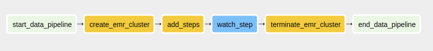

# Immigration Data Lake <!-- omit in toc -->

The scope of the project is to build a data lake on S3. The data lake will allow users to query immigration data. Moreover, the data lake will provide weather, demographic and airport data for immigration.

## 1. Table of Contents

- [1. Table of Contents](#1-table-of-contents)
- [2. Project Scope](#2-project-scope)
- [3. Project Structure](#3-project-structure)
- [4. Datasets](#4-datasets)
- [5. Data Source Description](#5-data-source-description)
  - [5.1. I94 Immigration Data](#51-i94-immigration-data)
  - [5.2. World Temperature Data](#52-world-temperature-data)
  - [5.3. U.S. City Demographic Data](#53-us-city-demographic-data)
- [6. Data Exploration](#6-data-exploration)
  - [6.1. Immigration Dataset](#61-immigration-dataset)
  - [6.2. Demographics Data](#62-demographics-data)
  - [6.3. World Temperature Data](#63-world-temperature-data)
- [7. Data Model](#7-data-model)
  - [7.1. Purpose of data model](#71-purpose-of-data-model)
  - [7.2. Schema](#72-schema)
  - [7.3. Immigration Facts Table](#73-immigration-facts-table)
  - [7.4. Person Dimension Table](#74-person-dimension-table)
  - [7.5. Demographics Dimension Table](#75-demographics-dimension-table)
  - [7.6. Weather Dimension Table](#76-weather-dimension-table)
- [8. Data Quality Checks](#8-data-quality-checks)
- [9. Project Setup](#9-project-setup)
  - [9.1. Setup environment](#91-setup-environment)
  - [9.2. AWS CLI](#92-aws-cli)
  - [9.3. AWS Configure](#93-aws-configure)
    - [9.3.1. Generate Credentials](#931-generate-credentials)
    - [9.3.2. Configure AWS for AWS CLI](#932-configure-aws-for-aws-cli)
  - [9.4. Create EMR Roles](#94-create-emr-roles)
  - [9.5. Setup Docker and Docker-Compose](#95-setup-docker-and-docker-compose)
  - [9.6. Pyspark (optional)](#96-pyspark-optional)
  - [Download the data](#download-the-data)
  - [9.7. Setup AWS](#97-setup-aws)
  - [9.8. Airflow](#98-airflow)
  - [9.9. Reminder](#99-reminder)
  - [Scenarios](#scenarios)
    - [The data was increased by 100x.](#the-data-was-increased-by-100x)
    - [The pipelines would be run on a daily basis by 7 am every day.](#the-pipelines-would-be-run-on-a-daily-basis-by-7-am-every-day)
    - [The database needed to be accessed by 100+ people.](#the-database-needed-to-be-accessed-by-100-people)
- [10. References](#10-references)

## 2. Project Scope

In the following sections we will first start by describing the datasets that we have. Afterwards we will gather the data and provide the source of every dataset. We will then do some data exploration before defining the data model. Once the data model has been provided, we will design the ELT pipeline. Scripts and instructions will be provided to upload the data into an S3 bucket and execute the pipeline on AWS.

## 3. Project Structure

The data exploration is done in data_exploration.ipynb and uses [pyspark docker](https://hub.docker.com/r/jupyter/pyspark-notebook) [1].

The ETL pipeline uses a local airflow instance. The dags are defined locally and are based on this [tutorial](https://www.startdataengineering.com/post/how-to-submit-spark-jobs-to-emr-cluster-from-airflow/) [2].

The airflow docker used is developed by puckel and is obtained from this [repository](https://github.com/puckel/docker-airflow) [3]. The LICENSE file is included in this repository under the name puckel_docker_airflow_license.txt.

The airflow DAG:



## 4. Datasets

- I94 Immigration Data: This data comes from the US National Tourism and Trade Office. A data dictionary is included in the workspace. [This](https://travel.trade.gov/research/reports/i94/historical/2016.html) is where the data comes from. There's a sample file so you can take a look at the data in csv format before reading it all in. You do not have to use the entire dataset, just use what you need to accomplish the goal you set at the beginning of the project.
- World Temperature Data: This dataset came from Kaggle. You can read more about it [here](https://www.kaggle.com/berkeleyearth/climate-change-earth-surface-temperature-data).
- U.S. City Demographic Data: This data comes from OpenSoft. You can read more about it [here](https://public.opendatasoft.com/explore/dataset/us-cities-demographics/export/).

## 5. Data Source Description

### 5.1. I94 Immigration Data

Each report contains international visitor arrival statistics by world regions and select countries (including top 20), type of visa, mode of transportation, age groups, states visited (first intended address only), and the top ports of entry (for select countries).

### 5.2. World Temperature Data

This dataset contains 5 variables: the date, the average temperature, the average temperature uncertainty, the state and the country.

### 5.3. U.S. City Demographic Data

This dataset contains 12 variables: city, state, race, count, median age, male population, female population, total population, number of veterans, foreign-born, average household size and state code.

## 6. Data Exploration

Our data exploration was done in our data_exploration.ipynb notebook.

### 6.1. Immigration Dataset

The dictionnary is obtained from the I94_SAS_Labels_Description.SAS file provided with the I-94 dataset.

| Column Name | Description |
| :--- | :--- |
| CICID* | ID |
| I94YR | 4 digit year |
| I94MON | numeric month |
| I94CIT | 3 digit code for country of origin |
| I94RES | 3 digit code for country of residence |
| I94PORT | port of entry |
| ARRDATE | arrival date in the USA |
| I94MODE | mode of transportation: 1 = air, 2 = sea, 3 = land, 4 = not reported) |
| I94ADDR | state of arrival |
| DEPDATE | departure date from the USA |
| I94BIR | age of respondent in years |
| I94VISA | visa codes collapsed into three categories: 1 = Business; 2 = Pleasure; 3 = Student |
| COUNT | summary statistics |
| DTADFILE | date added to I-94 files |
| VISAPOST | department of state where where Visa was issued |
| OCCUP | occupation that will be performed in U.S. |
| ENTDEPA | arrival flag: admitted or paroled into the US |
| ENTDEPD | departure flag: departed, lost I-94, or deceased |
| ENTDEPU | update flag: apprehended, overstayed, or adjusted to perm residence |
| MATFLAG | match flag: match of arrival and departure records |
| BIRYEAR | 4 digit year of birth |
| DTADDTO | character date field: date to which admitted to U.S. (allowed to stay until)  |
| GENDER | non-immigrant sex |
| INSNUM | INS number |
| AIRLINE | airline used to arrive in U.S. |
| ADMNUM | admission number |
| FLTNO | flight number of airline used to arrive in U.S. |
| VISATYPE | class of admission legally admitting the non-immigrant to temporarily stay in U.S. |

### 6.2. Demographics Data

| Column Name | Description |
| :--- | :--- |
| City | the city |
| State | the state |
| Race | the race of the given entry |
| Count | number of people that identify of this race |
| Median Age | the median age |
| Male Population | the male population count |
| Female Population | the female population count |
| Total Population | the total population count |
| Number of Veterans | the number of veterans |
| Foreign-born | the number of foreign-born people |
| Average Household Size | the average household size |
| State Code | the two letter state code |

### 6.3. World Temperature Data

| Column Name | Description |
| :--- | :--- |
| dt | ID |
| AverageTemperature | average land temperature in celsius |
| AverageTemperatureUncertainty | the 95% confidence interval around the average |
| State | state |
| Country | country |

## 7. Data Model

### 7.1. Purpose of data model

We want to provide a star schema that allows analytics operations to answer questions such as:

- Gender distribution of immigrants per state
- Average temperature of country of origin versus state of arrival
- Median age of immigrants versus median age of state of arrival
- What is the most prevalant race in state of arrival versus the country of origin

### 7.2. Schema


Here is the final schema of our data model.
### 7.3. Immigration Facts Table

This dataset also comes with the file I94_SAS_Labels_Descriptions.SAS that describes the labels. We extract from this file a table that maps the 3 digit country codes to the actual country names. We clean it up and create a table of mappings in csv format. It contans the following fields:

| code | 3 digit code of country
| country | country name

We also mapped the transportation type using the following mapping:

```
{1: 'air', 2: 'sea', 3: 'land', 4: 'not reported'}
```

The date fields like arrival date and departure date are SAS numeric fields so they were converted to datetime.

### 7.4. Person Dimension Table

For the person dimension table we extracted the fields shown in the schema above. Using the description file, we created a country code mapping table to map the country codes to the actual country names. The person data can be linked to the immigration data using the id.

### 7.5. Demographics Dimension Table

We extracted the data from the demographics data source. The demographics data can be linked to the immigration data using the state.

### 7.6. Weather Dimension Table

We extracted the data from the demographics data source. The weather data can be linked to the immigration data using the state.

## 8. Data Quality Checks

In the pyspark-etl script, we throw errors if any of the fact or dimension tables has a length of 0.

## 9. Project Setup

These are the required steps to setup the project. Make sure to issue all commands from the root directory of the project.

### 9.1. Setup environment

Install pip/conda environment from data-lake-requirements.txt file
### 9.2. AWS CLI

Follow the instructions [here](https://docs.aws.amazon.com/cli/latest/userguide/install-cliv2-linux.html#cliv2-linux-install).

Or simply as mentioned in the above link, use the following commands.

```
curl "https://awscli.amazonaws.com/awscli-exe-linux-x86_64.zip" -o "awscliv2.zip"
unzip awscliv2.zip
sudo ./aws/install
```

### 9.3. AWS Configure

#### 9.3.1. Generate Credentials

If you don't have your access key, follow the guide [here](https://docs.aws.amazon.com/cli/latest/userguide/cli-configure-quickstart.html#cli-configure-quickstart-config).

Or follow these steps:

- Go to my security crendentials on aws dashboard
- Then Access Keys
- Create new access key

#### 9.3.2. Configure AWS for AWS CLI

Type the following command:

```
aws configure
```

Enter your access key id and secret access key. Choose your region and use json for output format.

### 9.4. Create EMR Roles

Create EMR_DefaultRole using this command:

```
aws emr create-default-roles
```

Check if the roles were properly created using

aws iam list-roles

### 9.5. Setup Docker and Docker-Compose

Setup [Docker](https://docs.docker.com/engine/install/) and [Docker-Compose](https://docs.docker.com/compose/install/)

### 9.6. Pyspark (optional)

Run jupyter/pyspark-notebook docker

Make sure you are located in the project **root** directory before running these commands.

Use the following command:

```
docker run -it -p 8888:8888 jupyter/pyspark-notebook
```

Use the -v flag to persist the data generated. Map a host folder, in our case the root project folder to the docker work folder. The --rm flag removes the image after we exit, it is not mandatory.

```
docker run -it --rm -p 8888:8888 -v $(pwd):/home/jovyan/work jupyter/pyspark-notebook
```


### Download the data

The I94 files must be downloaded manually from udacity project because they are not available online. For this example we will use the file i94_apr16_sub.sas7bdat. Then run get_data.py file to get the weather and demographics data. It will also convert the i94 to csv and generate code mapping data file.

```
python get_data.py
```

### 9.7. Setup AWS

Create an IAM user with the following permission:

- AmazonS3FullAccess

Create in the root directory a file called creds.cfg with the following content:

```
[AWS]
KEY=<your aws iam user role key>
SECRET=<your aws iam user role secret>
```

Run this python script to setup S3 bucket and copy all the data to it. Modify the bucket name in the file if needed.

```
python infrastructure_setup.py
```

### 9.8. Airflow

To run airflow docker use:

```
docker-compose -f docker-compose-LocalExecutor.yml up -d
```

To shutdown airflow docker use:

```
docker-compose -f docker-compose-LocalExecutor.yml down
```

### 9.9. Reminder

Shut down all EMR clusters and S3 buckets manually in case of error.

### Scenarios

#### The data was increased by 100x.

We can increase the EMR size to handle much larger datasets.

#### The pipelines would be run on a daily basis by 7 am every day.

The Airflow DAG will be scheduled to run everyday at 7 am. It will retry on failure.
#### The database needed to be accessed by 100+ people.

The data can be accessed by as many people as needed by scaling up.
## 10. References

[1] https://hub.docker.com/r/jupyter/pyspark-notebook \
[2] https://www.startdataengineering.com/post/how-to-submit-spark-jobs-to-emr-cluster-from-airflow/ \
[3] https://github.com/puckel/docker-airflow
